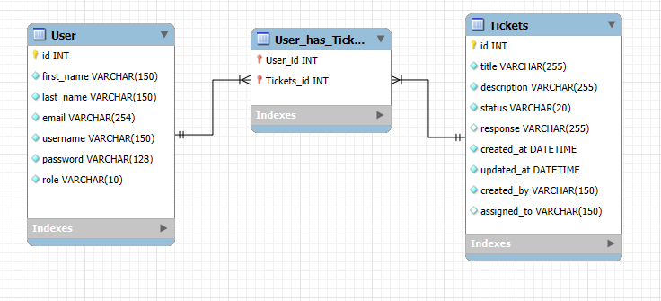

# API Sistema de Atendimento

Esta API fornece um sistema de gerenciamento de tickets para clientes e funcionários gerenciarem solicitações de atendimento. Os clientes podem criar tickets, enquanto os funcionários podem atualizar os status e as respostas dos tickets.



---

## Instalação e Configuração

### Pré-requisitos
- Python 3.8+
- Django 5.1+
- Django REST Framework
- Django REST Framework SimpleJWT

### Passos da Instalação
1. Clone o repositório e navegue até o diretório do projeto.
2. Crie um ambiente virtual e ative-o:
   ```bash
   python -m venv venv
   source venv/bin/activate  #Windows: source venv\Scripts\activate
   ```
3. Instale as dependências:
   ```bash
   pip install django djangorestframework djangorestframework-simplejwt
   ```
4. Aplique as migrações:
   ```bash
   python manage.py makemigrations
   python manage.py migrate
   ```
5. Inicie o servidor local:
   ```bash
   python manage.py runserver
   ```

---

## Autenticação

Esta API usa autenticação baseada em JWT. Tokens são fornecidos via cookies para segurança aprimorada.

### Token Endpoints
- `POST /api/token/`: Obtenha um token de acesso e atualização.
- `POST /api/token/refresh/`: Atualize o token de acesso.
- `POST /api/logout/`: Efetue logout limpando os cookies.

---

## Endpoints

### Endpoints Públicos

#### `POST /api/register/`
- **Description**: Registra um novo usuário.
- **Request Body**:
  ```json
    {
        "first_name": "Michael",
        "last_name": "De Santa",
        "email": "michael.santa@estudante.ufla.br",
        "username": "michael",
        "password": "michael123",
        "role": "client"
    }
  ```
- **Response**:
  ```json
  {
      "message": "User registered successfully"
  }
  ```

---

### Endpoints Protegidos
Todos os endpoints protegidos exigem autenticação via JWT.

#### `GET /api/me/`
- **Description**: Recupere informações sobre o usuário autenticado.
- **Response**:
  ```json
  {
      "id": 1,
      "username": "Client",
      "role": "client"
  }
  ```

#### `GET /tickets/`
- **Description**: Recupere uma lista de tickets.
- **Behavior**:
  - **Clients**: Vê apenas os tickets que eles criaram.
  - **Employees**: Vê todos os tickets.
- **Response Example**:
  ```json
  [
      {
          "id": 1,
          "title": "VPN Connection Issue",
          "description": "Cannot connect to VPN",
          "status": "open",
          "response": null,
          "created_by": "michael",
          "assigned_to": [1],
          "created_at": "2024-12-10T12:00:00Z",
          "updated_at": "2024-12-10T13:00:00Z"
      }
  ]
  ```

#### `POST /tickets/`
- **Description**: Cria um novo ticket.
- **Request Body**:
  ```json
  {
      "title": "VPN Issue",
      "description": "Cannot connect to VPN",
      "assigned_to": [1]
  }
  ```
- **Response**:
  ```json
  {
      "id": 1,
      "title": "VPN Issue",
      "description": "Cannot connect to VPN",
      "status": "open",
      "response": null,
      "created_by": "michael",
      "assigned_to": [1],
      "created_at": "2024-12-10T12:00:00Z",
      "updated_at": "2024-12-10T12:00:00Z"
  }
  ```

#### `PUT /tickets/{id}/`
- **Description**: Atualiza um ticket.
- **Behavior**:
  - **Clients**: Não é permitido atualizar.
  - **Employees**: Pode atualizar os campos `status` e `response`.
- **Request Body (Employees)**:
  ```json
  {
      "status": "in_progress",
      "response": "We are working on resolving the issue."
  }
  ```
- **Response**:
  ```json
  {
      "id": 1,
      "title": "VPN Issue",
      "description": "Cannot connect to VPN",
      "status": "in_progress",
      "response": "We are working on resolving the issue.",
      "created_by": "michael",
      "assigned_to": [1],
      "created_at": "2024-12-10T12:00:00Z",
      "updated_at": "2024-12-10T13:00:00Z"
  }
  ```

#### `DELETE /tickets/{id}`
- **Description**: Deleta um ticket.
- **Behavior**:
  - **Clients**: Podem deletar os próprios tickets.
  - **Employees**: Podem deletar qualquer ticket.
---

## User Roles and Permissions

### Clients
- Podem criar tickets.
- Podem visualizar seus próprios tickets.
- Podem vizualizar suas próprias informações.

### Employees
- Pode visualizar todos os tickets.
- Pode atualizar os campos `status` e `response` de qualquer ticket.

---

